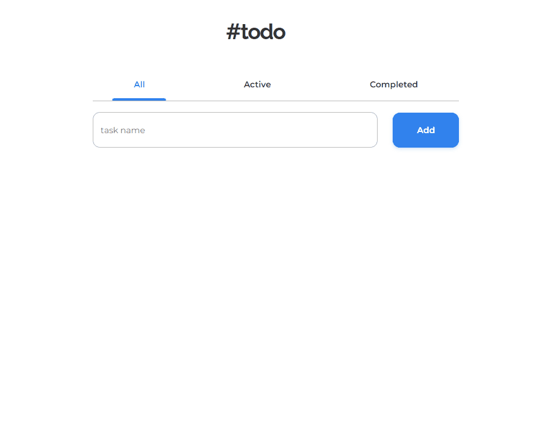

<div>
  <h1 align="center">✅ 𝐓𝐨𝐝𝐨 𝐚𝐩𝐩</h1>
  <p align="center">
  ❗ Solution for a challenge from <a href="http://devchallenges.io" target="_blank">Devchallenges.io</a>.
  </p>
</div>

<div align="center">
  <a href="#links">Links</a>&nbsp;&nbsp;&nbsp;|&nbsp;&nbsp;&nbsp;
  <a href="#technologies">Technologies</a>&nbsp;&nbsp;&nbsp;|&nbsp;&nbsp;&nbsp;
  <a href="#how-to-use">How To Use</a>
</div>

<div>
  <p>🔎 <strong>About: </strong>Application made to help you better organize your tasks and improve your productivity.</p>
</div>

<div>
  <h2>⚔️ 𝐓𝐡𝐞 𝐜𝐡𝐚𝐥𝐥𝐞𝐧𝐠𝐞</h2>
  <p>Users should be able to:</p>

  - [x] Add a new task
  - [x] Complete a task
  - [x] Toggle between All, Active and Completed
  - [x] Remove one or all tasks on the Completed tab
</div>

<div>
  <h2>⚙️ 𝐏𝐥𝐮𝐬:</h2>
  <p>✔️ Data stored in local storage so when the user refreshes the page or leaves it, the progress still exists.</p>
</div>

<div>
  <h2>👀 𝗣𝗿𝗲𝘃𝗶𝗲𝘄</h2>
  
</div>

<div>
  <h2 id="links">🔗𝐋𝐢𝐧𝐤𝐬</h2>
  <p>🗔 Demo URL: <a href="" target="_blank">Demo</a></p>
  <p>💡 Solution: <a href="" target="_blank">Solution</a></p>
  <p>🗡️ Challenge: <a href="" target="_blank">Challenge</a></p>
</div>

<h2 id="technologies">⚙️ 𝗧𝗲𝗰𝗵𝗻𝗼𝗹𝗼𝗴𝗶𝗲𝘀</h2>

<ul>
  <li>ReactJS</li>
  <li>Typescript</li>
  <li>Styled components</li>
  <li>React icons</li>
</ul>

<h2 id="how-to-use">📌 𝗛𝗼𝘄 𝗧𝗼 𝗨𝘀𝗲</h2>

```bash
# Clone this repository
$ git clone https://github.com/LeonardoYz/TodoList.git

# Go into the repository
$ cd TodoList

# Install dependencies
$ yarn install

# Run the application
$ yarn start
```